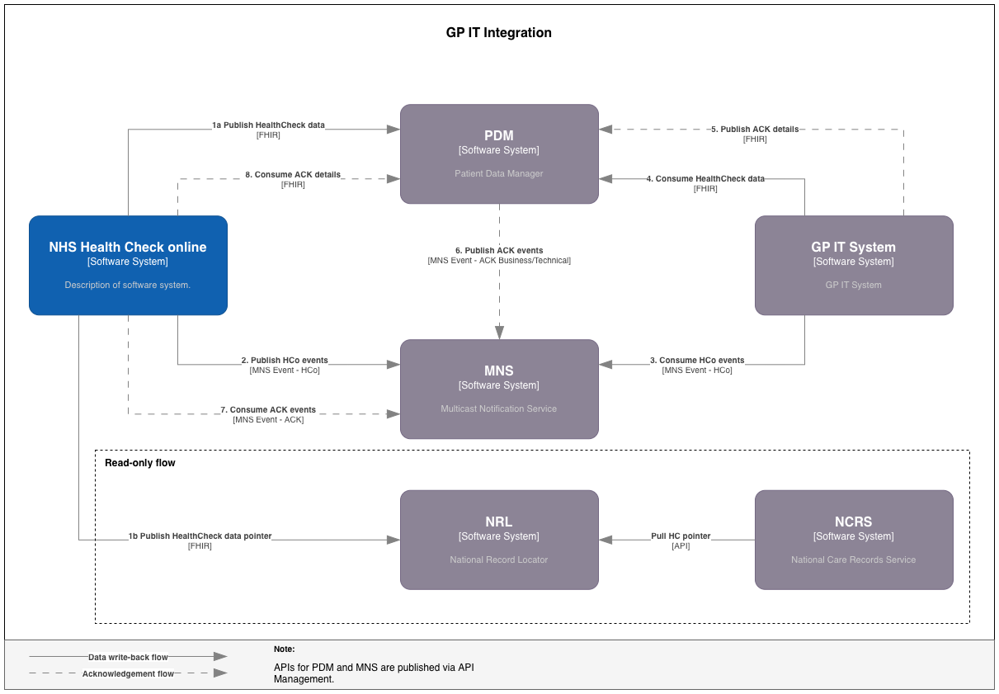

# Integration overview

## Introduction

One of the main capabilities of the NHS Health Check online service is integration with external services to ensure patient data are available within GP IT Systems. The diagram below illustrates the integration pattern.

### Flow

- 1a. NHSHC-o service writes results to PDM
- 1b. PDM (or NHSHC-o) creates 'pointer' to the results data in NRL
- 2\. NHSHC-o publishes a new event (direct integration with MNS)
- 3\. GP Supplier system subscribes to the event
- 4\. GP Supplier system initiates processes — retrieves the NHSHC-o results data for the patient via the PDM read API
- 5\. GP Supplier system publishes Acknowledgement (FHIR) in PDM

The process is asynchronous and is divided into two main parts: [payload processing](health-check-data-flow.md) and the [acknowledgement flow](acknowledgement-flow.md), each described on their respective pages.
